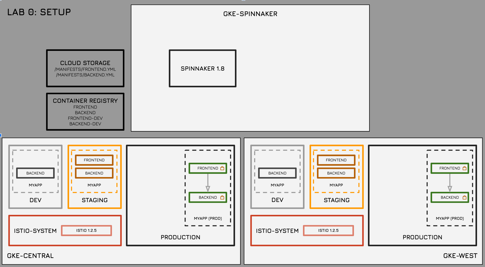

# Fairwinds Advanced Kubernetes Workshop

Kubernetes is quickly becoming the platform of choice for many enterprise developers and devops.  As environments grow, a single Kubernetes cluster is no longer an option.  Deploying and running applications in multiple Kubernetes clusters comes with added complexity.  Thanks to the open source community, we have numerous tools to help us manage multiple clusters and application deployment across these clusters.  This lab focuses on best practices around operating multiple clusters, managing application deployments across multiple clusters, and advanced routing scenarios in a multi-cluster Kubernetes environment.

## Lab 0 - Setup

*Lab 0 Diagram*

+  Clone Repo with workshop files
+  Run setup script
+  Review the environment

## Lab 1 - Build

+ Example development workflow using Skaffold

## Lab 2 - Deploy

+ Configure Spinnaker Pipelines
+ Trigger a Cloud Build of the the Docker image
+ Monitor Pipeline and trigger canary deployment

## Lab 3 - Control

### Istio

+ Gateways, VirtualServices, and DestinationRules
+ Request Routing
+ Rate Limiting
+ Circuit Breaking
+ mTLS

### Global Load Balancing

+ Nginx Configmap
+ Access the load balancer
+ Control Traffic

## Lab 4 - Monitor

+ Prometheus and Grafana Metrics
+ Tracing with Jaeger
+ Stackdriver logging and monitoring
+ Visualization with Kiali

## Resources

+ [Lab Guide](docs/lab_guide.pdf)
+ [Slides](docs/slides.pdf)
